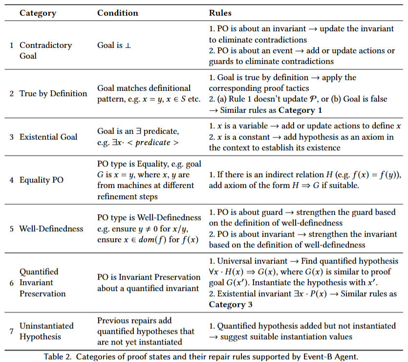

# Event-B Agent

Event-B Agent is a Rodin plug-in.
This project includes both the core and UI components of the plug-in.

## Prerequisite
Java 17  
[Eclipse IDE for Eclipse Committers 2024-03](https://www.eclipse.org/downloads/packages/release/2024-03/r)  
[Rodin 3.9 developer version](https://sourceforge.net/projects/rodin-b-sharp/files/Core_Rodin_Platform/3.9/)

## Setup
### Set Rodin as target platform
In Eclipse `Preferences > Plug-in Development > Target Platform`, select `Add... > Nothing: Start with an empty target definition`.  
Add new target definition with name `Rodin 3.9`, select `Add... > Software Site`.  
In "Add Content" page, select `Add...`, with name `Rodin 3.9` and browse `Local...` to select the directory containing Rodin 3.9 developer version. `Select All > Finish`.  
Finally, select `Rodin 3.9` as the target platform.

### Add helper plug-ins in target platform
Using similar procedure as described above, add the following plug-ins necessary for this repository: 
<ul>
    <li><b>SMT Solvers</b> from http://rodin-b-sharp.sourceforge.net/updates</li>
    <li><b>ProB for Rodin</b> from http://stups.hhu-hosting.de/rodin/prob1/release</li>
    <li>(Optional, install if ProB requires) <b>M2E - SLF4J over Logback Logging</b> from http://download.eclipse.org/releases/2023-12</li>
</ul>

### Run Rodin plug-in
In Package Explorer, select `Import projects... > Git > Projects from Git`, then import this repository.  
In Run Configurations, double click on `Eclipse Application` to create a new run configuration named `Rodin Plug-in`.  
Under "Program to Run", select `Run an application`.  
Select `Plug-ins > Launch with: Plug-ins selected below`. Search for `test` and then click on `Deselect All`. Click on `Validate Plug-ins` to detect issues with the selected plug-ins.  
Apply and Run.

## Project Structure
**EventB_Agent_Core**  
The plug-in that includes core functionalities.

**EventB_Agent_UI**  
The plug-in for UI.

### Proof States and Repair Rules
